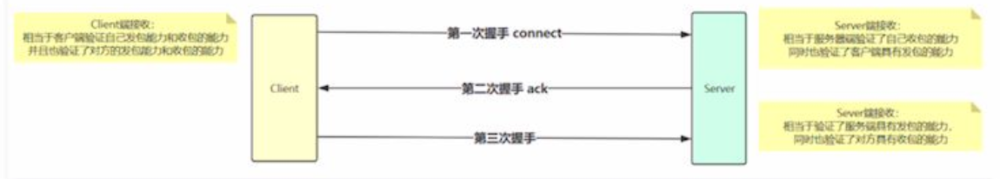
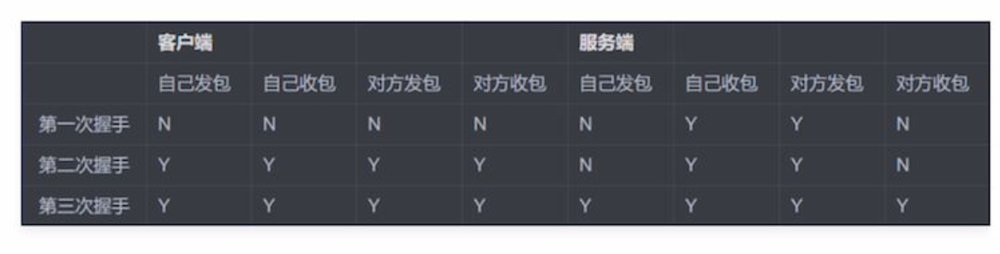
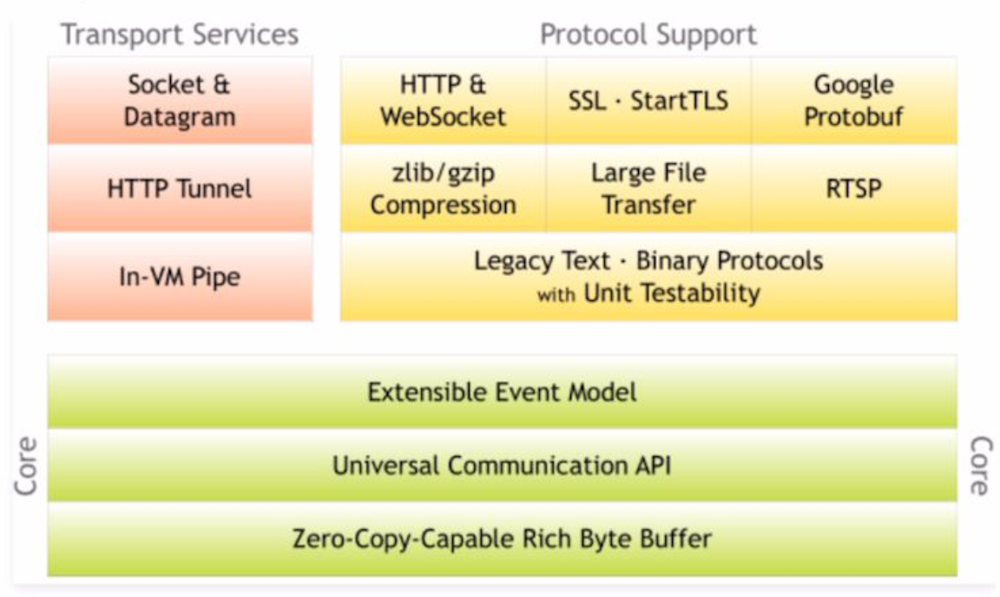

# TCP基础理论

Socket基础概念:

* Socket又称“套接字”，应用程序通常通过“套接字”向网络发出请求或者应答网络请求Socket、ServerSocket类库位于jasa.net包中。ServerSocket用于服务器端，Socket是建立网络连接时使用的。在连接成功时，应用程序两端都会产生一个Socket实例，操作这个实例，完成所需的会话。对于一个网络连接来说，套接字是平等的，不因为在服务器端或在客户端而产生不同级别。不管是Socket还是ServerSocket它们的工作都是通过SocketImpl类及其子类完成的。

* 套接字之间的连接过程可以分为四个步骤：
  * 服务器监听；
  * 客户端请求服务器；
  * 服务器确认；
  * 客户端确认，进行通信。

* 经常在面试的时候，都会被问到TCP的基础问题：什么是三次握手，四次挥手（对于建立连接和断开连接），为什么需要三次握手，为什么需要四次挥手（这些次数是怎么来的）？如下图，在建立连接的时候进行3次握手；



* 同理，我们可以推理出四次挥手的基本原理，如下表格所示



总结：无论三次握手还是四次挥手，都是来校验对方数据包的“收发能力”！

# Netty介绍

我们为为什么选择Netty？原因无他，简单！

* 我们再也不必去编写复杂的代码逻辑去实现通信，我们再也不需要去考虑性能问题，不需要考虑编解码问题，半包读写问题等，这些强大的Netty已经帮我们实现好了，我们只需要使用即可！
* Netty是也就最流行的NIO框架，他的健壮性、功能、性能、可定制性和可扩展性在同类框架都是首屈一指的。它已经得到成百上千的商业/商用项目验证，如Hadoop的RPC框架Avro、以及我们之后学习的JMS框架，强大的RocketMQ、还有主流的分布式通信框架Dubbo等等；

* Netty是一个NIO client-server(客户端服务器)框架，使用Netty可以快速开发网络应用，例如服务器和客户端协议。Netty提供了一种新的方式来使开发网络应用程序，这种新的方式使得它很容易使用和有很强的扩展性。Netty的内部实现是很复杂的，但是Netty提供了简单易用的api从网络处理代码中解耦业务逻辑。Netty是完全基于NIO实现的，所以整个Netty都是异步的。



[网络编程之Netty一站式精讲](https://www.imooc.com/read/82)

# Netty Demo101

最简单的Netty示例

Netty实现通信的步骤：（客户端与服务器端基本一致）

* 创建两个的NIO线程组，一个专门用于网络事件处理（接受客户端的连接），另一个则进行网络通信读
  写。
* 创建一个ServerBootstrap对象，配置Netty的一系列参O数，例如接受传出数据的缓存大小等等。
* 创建一个实际处理数据的类ChannelInitializer,进行初始化的准备工作，比如设置接受传出数据的字符
  集、格式、已经实际处理数据的接囗。
* 绑定端口，执行同步阻塞方法等待服务器端启动

引入netty依赖:

```xml
<dependency>
    <groupId>io.netty</groupId>
    <artifactId>netty-all</artifactId>
    <version>4.1.12.Final</version>
</dependency>
```

## Netty Server

Server:

```java
package com.example;

import io.netty.bootstrap.ServerBootstrap;
import io.netty.channel.*;
import io.netty.channel.nio.NioEventLoopGroup;
import io.netty.channel.socket.SocketChannel;
import io.netty.channel.socket.nio.NioServerSocketChannel;

public class Server {

    public static void main(String[] args) throws InterruptedException {
        // 1.创建两个线程组: 一个用于进行网络连接接受的, 另一个用于我们的实际处理（网络通信的读写）
        EventLoopGroup bossGroup = new NioEventLoopGroup();
        EventLoopGroup workGroup = new NioEventLoopGroup();

        // 2.通过辅助类去构造Server/client
        ServerBootstrap serverBootstrap = new ServerBootstrap();


        // 3.NIO基础设置
        // 3.1 绑定两个线程组
        serverBootstrap.group(bossGroup, workGroup)
            // 3.2 server端配置NioServerSocketChannel
            .channel(NioServerSocketChannel.class)
            // 3.3 设置链接超时时间
            .option(ChannelOption.CONNECT_TIMEOUT_MILLIS, 3000)
            // 3.4 TCP backlog参数 = sync队列 + accept队列
            .option(ChannelOption.SO_BACKLOG, 1024)
            // 3.5 配置项 通信不延迟
            .childOption(ChannelOption.TCP_NODELAY, true)
            // 3.6 配置项 接受和发送缓冲区大小
            .childOption(ChannelOption.SO_RCVBUF, 1024 * 32)
            .childOption(ChannelOption.SO_SNDBUF, 1024 * 32)
            // 3.7 初始化ChannelInitializer, 用于构建双向链表pipeline添加业务handler处理
            .childHandler(new ChannelInitializer<SocketChannel>() {
                @Override
                protected void initChannel(SocketChannel socketChannel) throws Exception {
                    //3.8这里仅仅只是添加一个业务处理器: ServerHandler
                    socketChannel.pipeline().addLast(new ServerHandler());
                }
            });

        // 4.服务器端绑定端口并启动服务: 使用channel级别的监听close端口阻塞的方式
        ChannelFuture cf = serverBootstrap.bind(8765).sync();
        cf.channel().closeFuture().sync();

        // 5.释放资源
        bossGroup.shutdownGracefully();
        workGroup.shutdownGracefully();
    }
}
```

ServerHandler

```java
package com.example;

import io.netty.buffer.ByteBuf;
import io.netty.buffer.Unpooled;
import io.netty.channel.ChannelHandlerContext;
import io.netty.channel.ChannelInboundHandlerAdapter;


public class ServerHandler extends ChannelInboundHandlerAdapter {

    @Override
    public void channelInactive(ChannelHandlerContext ctx) throws Exception {
        System.err.println("server channel active..");
    }


    @Override
    public void channelRead(ChannelHandlerContext ctx, Object msg) throws Exception {
        // 1. 读取客户端的数据(缓存中去取并打印到控制台)
        ByteBuf buf = (ByteBuf) msg;
        byte[] request = new byte[buf.readableBytes()];
        buf.readBytes(request);

        String requestBody = new String(request, "utf-8");
        System.err.println("Server: " + requestBody);

        // 2.返回响应数据
        String responseBody = "返回响应数据: " + requestBody;

        ctx.writeAndFlush(Unpooled.copiedBuffer(responseBody.getBytes()));
    }


    @Override
    public void exceptionCaught(ChannelHandlerContext ctx, Throwable cause)
        throws Exception {
        ctx.fireExceptionCaught(cause);
    }
}
```

## Netty Client

client

```java
package com.example;

import io.netty.bootstrap.Bootstrap;
import io.netty.buffer.Unpooled;
import io.netty.channel.ChannelFuture;
import io.netty.channel.ChannelInitializer;
import io.netty.channel.ChannelOption;
import io.netty.channel.EventLoopGroup;
import io.netty.channel.nio.NioEventLoopGroup;
import io.netty.channel.socket.SocketChannel;
import io.netty.channel.socket.nio.NioSocketChannel;


public class Client {
    public static void main(String[] args) throws InterruptedException {


        //1.创建两个线程组: 只需要一个线程组用于我们的实际处理（网络通信的读写）
        EventLoopGroup workGroup = new NioEventLoopGroup();

        //2.通过辅助类去构造client，然后进行配置响应的配置参数

        Bootstrap bootstrap = new Bootstrap();
        bootstrap.group(workGroup)
            .channel(NioSocketChannel.class)
            .option(ChannelOption.CONNECT_TIMEOUT_MILLIS, 3000)
            .option(ChannelOption.SO_RCVBUF, 1024 * 32)
            .option(ChannelOption.SO_SNDBUF, 1024 * 32)
            //3.初始化ChannelInitializer
            .handler(new ChannelInitializer<SocketChannel>() {
                @Override
                protected void initChannel(SocketChannel ch) throws Exception {
                    //3.1添加客户端业务处理类
                    ch.pipeline().addLast(new ClientHandler());
                }
            });

        // 4.服务器端绑定端口并启动服务： 使用channel级别的监听close端口阻塞的方式
        ChannelFuture cf = bootstrap
            .connect("127.0.0.1", 8765)
            .syncUninterruptibly();

        // 5.发送一条数据到服务器端
        cf.channel().writeAndFlush(Unpooled.copiedBuffer("hello netty!".getBytes()));

        // 6.休眠一秒钟后再发送一条数据到服务端
        Thread.sleep(1000);
        cf.channel().writeAndFlush(Unpooled.copiedBuffer("hello netty again!".getBytes()));

    }
}

```

ClientHandler

```java
package com.example;

import io.netty.buffer.ByteBuf;
import io.netty.buffer.Unpooled;
import io.netty.channel.ChannelHandlerContext;
import io.netty.channel.ChannelInboundHandlerAdapter;

public class ClientHandler extends ChannelInboundHandlerAdapter {

    /**
     * channelActive通道激活方法
     */

    @Override
    public void channelActive(ChannelHandlerContext ctx) throws Exception {
        System.err.println("server channel active.");
    }


    /**
     * channelRead读写数据核心方法
     */
    @Override
    public void channelRead(ChannelHandlerContext ctx, Object msg) throws Exception {

        // 1.读取客户端的数据（缓存中去取并打印到控制台）
        ByteBuf buf = (ByteBuf) msg;
        byte[] request = new byte[buf.readableBytes()];
        buf.readBytes(request);
        String requestBody = new String(request,
                                        "utf-8");
        System.err.println("Server: " + requestBody);
        // 2.返回响应数据
        String responseBody = "返回响应数据," + requestBody;
        ctx.writeAndFlush(Unpooled.copiedBuffer(responseBody.getBytes()));
    }

    /**
     * exceptionCaught捕获异常方法
     */
    @Override
    public void exceptionCaught(ChannelHandlerContext ctx, Throwable cause) throws Exception {
        ctx.fireExceptionCaught(cause);
    }
}

```


# Netty TCP粘包拆包问题的处理

TCP本质是一个流协议, 流: 没有界限的意思

TCP底层并不知道上层的业务含义, 多少字节是一个数据包, 只能根据TCP缓冲区实际情况对数据包进行划分.


